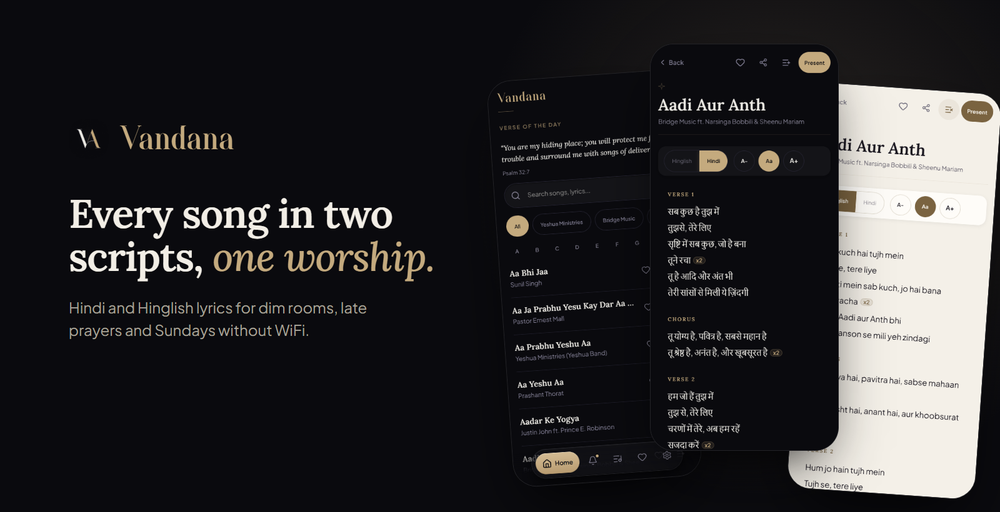
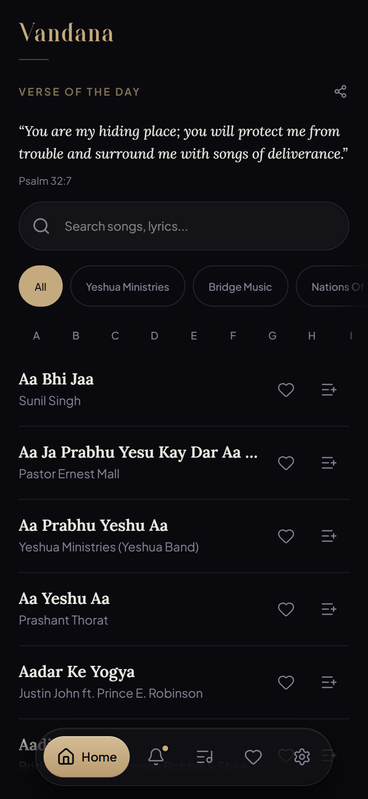
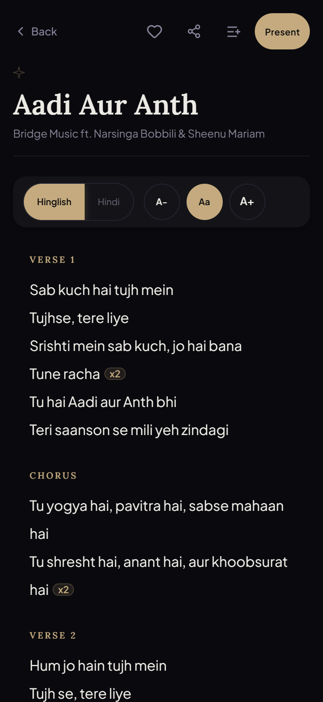
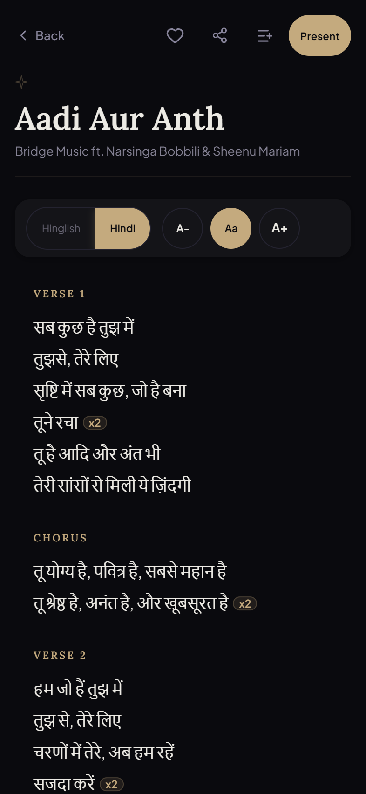
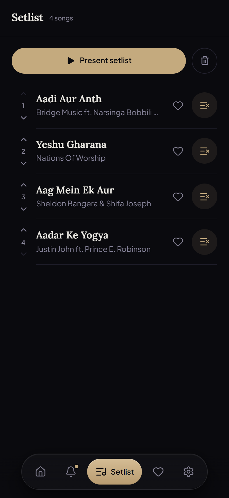
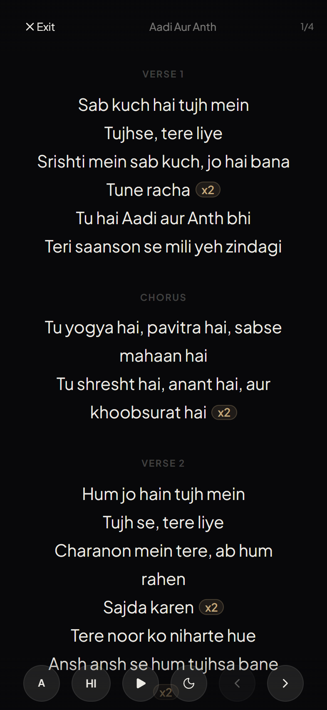
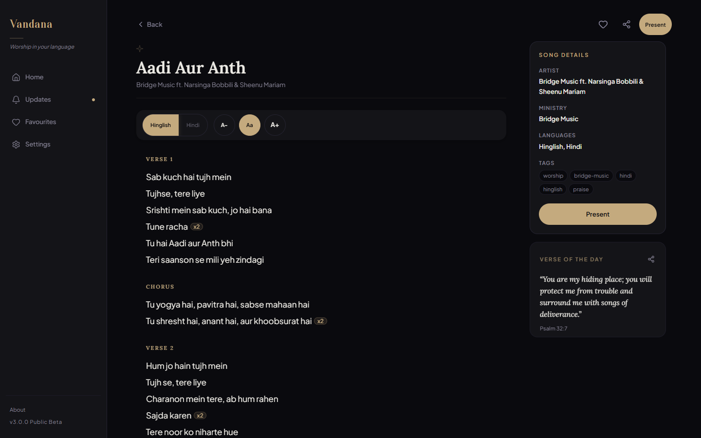
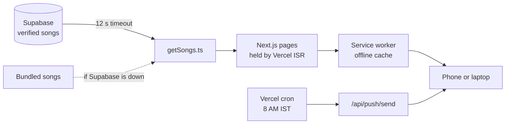

<p align="center">
  
</p>

<p align="center">
  <strong>A worship lyrics app for Hindi-speaking churches, with every song in Devanagari and Hinglish.</strong><br>
  Over 3,000 songs, one tap between scripts, and a present mode for leading from a phone.
</p>

<p align="center">
  <a href="https://vandanaapp.vercel.app"><strong>Open Vandana</strong></a>
  &nbsp;·&nbsp;
  <a href="#features">Features</a>
  &nbsp;·&nbsp;
  <a href="#how-it-works">How it works</a>
  &nbsp;·&nbsp;
  <a href="#run-it-locally">Run it locally</a>
</p>

<p align="center">
  
  
  
  
</p>

## Why Vandana

Worship in Hindi-speaking churches happens in two scripts. Some people read Devanagari, many read Hindi typed in Roman letters, and most song sites offer one or the other, with bad fonts, missing verses and a layout built for a desktop.

Vandana stores every song in both, as equals, and switches with one tap. It is dark by default because worship happens in dim rooms, it has a parchment theme for daylight, and it installs like an app and keeps working when the church WiFi does not.

## Screenshots

<table>
  <tr>
    <td align="center"><br><sub>The library and today's verse</sub></td>
    <td align="center"><br><sub>A song in Hinglish</sub></td>
    <td align="center"><br><sub>The same song in Hindi</sub></td>
    <td align="center"><br><sub>Tonight's setlist</sub></td>
    <td align="center"><br><sub>Present mode</sub></td>
  </tr>
</table>

<p align="center">
  
  <br><sub>On a laptop: a sidebar, the lyrics, and the song's details beside them</sub>
</p>

## Features

- **Two scripts, one song.** Hinglish and Hindi are written and stored as peers, not machine-converted. Switch per song, or set the one you read by default.
- **Present mode.** Full-screen lyrics for projecting from a phone, with auto-scroll and the screen kept awake. From a setlist, move to the next song without leaving it.
- **Setlists.** Build tonight's order from the library, reorder it, then present the whole set.
- **Find anything.** Search titles and lyrics in either script, filter by ministry, or jump through the A to Z index.
- **Verse of the day.** A verse on the home screen that changes with the time of day, shareable as an image, and an optional morning notification.
- **Favourites and recents,** kept on the device, with favourites saved for offline reading.
- **Parchment light theme.** A designed daylight theme, not an inverted dark one.
- **Laptop layout.** A sidebar and a details panel above 900 px; a floating nav on phones.
- **Hindi or English interface.** The app's own words follow your choice, separately from the lyrics.
- **Works offline.** An installable PWA that caches the pages you use, so Sunday morning does not depend on the signal.

## How it works



- **Only verified songs ship.** Imports land unverified and pass a quality gate before `is_verified` puts them in the library.
- **Pages outlive the database.** Song pages are cached by Vercel for a week and the library for an hour, so a paused free-tier database does not take the app down. If Supabase does not answer within 12 seconds, a bundled set of songs keeps the app from ever being empty.
- **Offline by intent.** The service worker pre-caches your favourites, and every setlist song with its present-mode page, so what you planned to sing is already on the phone.
- **Morning verse.** A daily cron sends the verse through Web Push (VAPID) to everyone who opted in.

## Built with

| Layer | Choice |
|---|---|
| App | Next.js 16 App Router, React 19, TypeScript |
| Styling | Tailwind CSS v4 and CSS custom properties, dark and parchment themes |
| Type | Lora for titles, Plus Jakarta Sans for text, Noto Sans Devanagari for Hindi, Cathez for the wordmark |
| Data | Supabase Postgres |
| Notifications | Web Push with VAPID, sent by a Vercel cron |
| Hosting | Vercel, with incremental static regeneration |

## Run it locally

You need Node 20 or newer.

```bash
git clone https://github.com/TheAlgo7/vandana-worship-app.git
cd vandana-worship-app
npm install
cp .env.example .env.local
npm run dev
```

Without Supabase details the app runs on the bundled songs. For the full library, point it at a Supabase project with the `songs` table:

```env
NEXT_PUBLIC_SUPABASE_URL=
NEXT_PUBLIC_SUPABASE_ANON_KEY=
SUPABASE_SERVICE_ROLE_KEY=
CRON_SECRET=
NEXT_PUBLIC_VAPID_PUBLIC_KEY=
VAPID_PRIVATE_KEY=
```

| Command | What it does |
|---|---|
| `npm run build` | Production build |
| `npm run lint` | ESLint |
| `python scripts/readme-shots.py` | Rebuilds the screenshots in this README from the live app |

## Project structure

```text
src/
  app/            library, song, present, setlist, favourites, updates, settings, install, ministry pages
  app/api/        push subscribe and send, search index, keep-alive ping
  components/     song cards, daily verse, navigation, font size, theme
  contexts/       favourites and setlist
  lib/            song loading and fallback, lyric sections, search, offline cache, push, UI strings
public/sw.js      the service worker
scripts/          import, quality triage and README screenshots
```

## Licence

Copyright © 2026 Gaurav Kumar, [The Algothrim](https://thealgothrim.com). All rights reserved. Song lyrics belong to their writers and publishers.

The code is public to read and learn from. It is not licensed for reuse.
